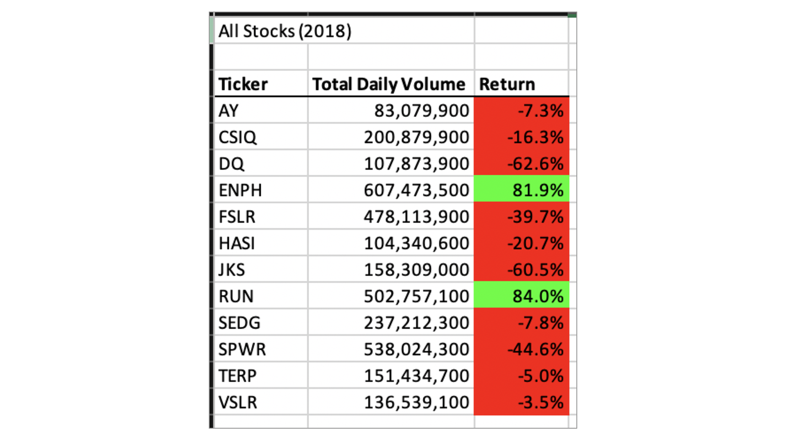
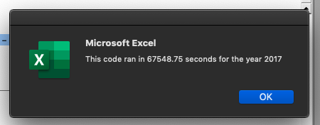
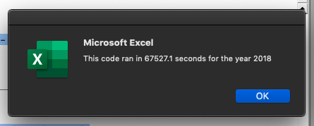

# VBA of Wall

## Overview of Project
The purupose of this analysis is to refactor the stocks in Steve's management portfolio and streamline the decision making process to buy or sell shares. We have created loops to find out the total daily volume and return for the year of 2017 and 2018 for the 12 indexed stocks.

## Results
The analysis showed that there is majority gain for the portfolio in 2017 with the exception of "TERP" with -7.2% loss. The gain ranges from 5.5% to 199.4%.
On the other hand, in 2018, the same porfolio faced a majority loss with the excpetion of "ENPH" (+81.9) and "RUN" (84.0%). The comparison between the 2 fiscal years indicated that 2017 was a better year of performance in terms of return and hopefully the protfolio will regain its momentum and recover the losses.

The refactored timeframe has proven to be a timesaver with the image proven below for the year 2017 and 2018, it took some time to the program to run manually.

## Summary

### Advantage and disadvantage of refractor coding
It is likely that refractor coding will be improving the existing structure of the program and allow us to add new features and functionalities that would improve the processes. However, it seems like it would take some time and would not be advised to condcuted if delivery deadline is near. It would need to be tested before release.

### Advantage and disadvantage of refractored VBA coding
VBA is integrated with Excel which makes it widely accessible for everyone who needs it. Most of the functionalities are sufficient for businesses and it is a small migration cost or no migration cost to some. Although VBA is widely archived through Mircosoft, VBA still offeres certain risks for people to create malicious macros. There are also other more tailored program for certain activities and excel is mostly good for general analytic coding.
